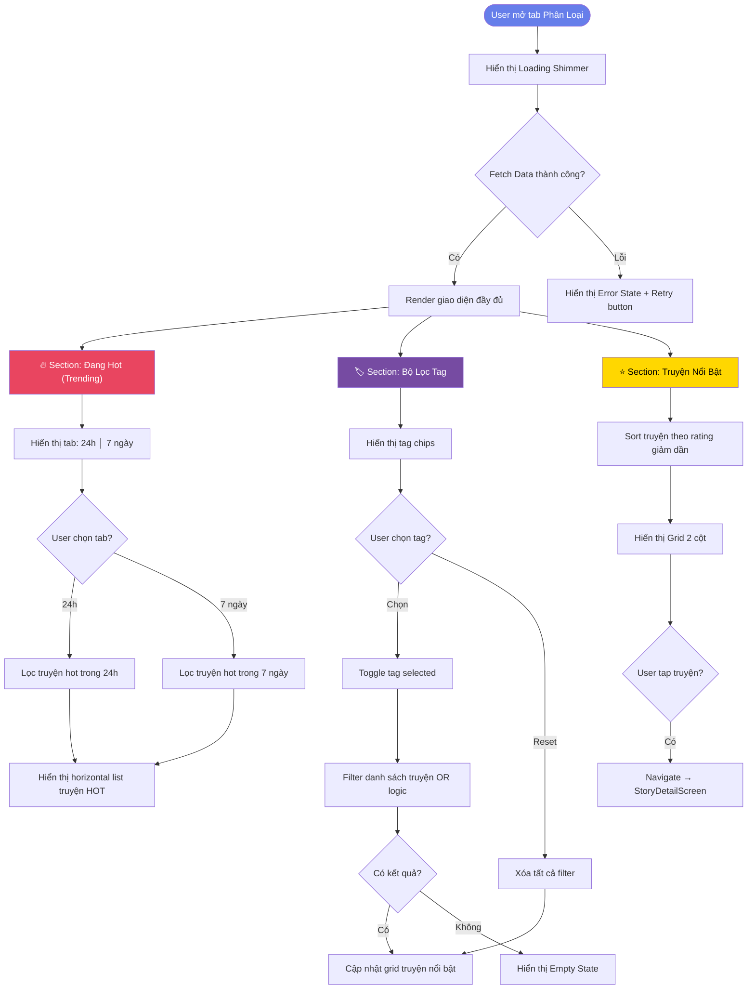
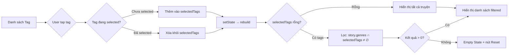
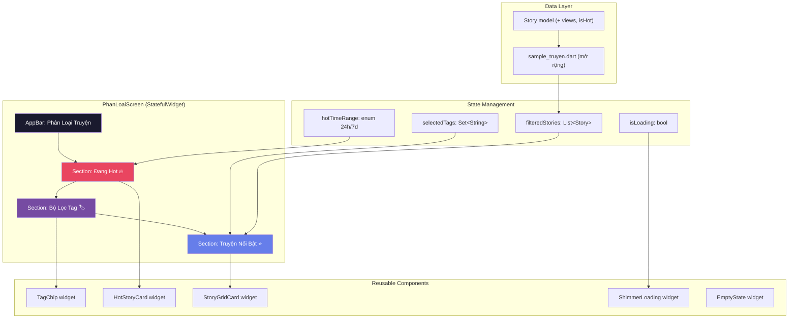

# Phân Tích & Đánh Giá: Màn Hình "Phân Loại" — MangaHay App

## 1. Tổng Quan Hiện Trạng Project

### Kiến trúc hiện tại
```
lib/
├── data/
│   └── sample_truyen.dart        # 3 truyện mẫu (hardcoded)
├── models/
│   ├── truyen.dart               # Model Story (thiếu views, isHot)
│   ├── chuong.dart               # Model Chapter
│   └── account.dart              # Model Account
├── screens/
│   ├── main_navigation.dart      # Bottom nav (4 tabs)
│   ├── home_screen.dart          # Trang chủ (hoàn thiện)
│   ├── search_screen.dart        # Tìm kiếm (hoàn thiện)
│   ├── phan_loai_screen.dart     # ⚠️ PLACEHOLDER - chưa làm
│   ├── thu_vien_screen.dart      # Thư viện
│   ├── truyen_detail_screen.dart # Chi tiết truyện
│   └── ...
├── widgets/
│   ├── truyen_card.dart          # Card truyện (ngang + dọc)
│   └── ...
├── utils/
│   ├── constants.dart            # Colors, Sizes, Strings
│   └── themes.dart               # Light/Dark theme
└── main.dart
```

### Nhận xét
- App Flutter đọc truyện tranh với **dark theme premium** (tông tím-xanh).
- Đã có design system tốt: `AppColors`, `AppSpacing`, `AppRadius`, `AppFontSizes`.
- `PhanLoaiScreen` hiện chỉ là **placeholder** ("Đang chuẩn bị làm").
- Dữ liệu sử dụng **sample data local** (không có API thật).

---

## 2. Phân Tích GAP — Model Hiện Tại vs. Yêu Cầu

| Trường yêu cầu | Có trong `Story`? | Ghi chú |
|---|---|---|
| `id` (string) | ✅ `id` | Đã có |
| `title` (string) | ✅ `title` | Đã có |
| `cover` (string) | ✅ `coverImage` | Đã có (asset path) |
| `rating` (number) | ✅ `rating` | Đã có (0-5) |
| `views` (number) | ❌ **THIẾU** | Cần thêm vào model |
| `tags` (string[]) | ✅ `genres` | Đã có (tên khác nhưng cùng mục đích) |
| `isHot` (boolean) | ❌ **THIẾU** | Cần thêm vào model |

> [!WARNING]
> **Model `Story` thiếu 2 trường quan trọng:** `views` và `isHot`. Cần bổ sung trước khi implement.

### Đánh giá mức độ ảnh hưởng khi thay đổi Model

Thay đổi model `Story` sẽ ảnh hưởng đến:
- [sample_truyen.dart](file:///d:/Code/code/Android/webdoctruyen/lib/data/sample_truyen.dart) — cần bổ sung `views` và `isHot` cho 3 truyện mẫu
- Các screen khác (`home_screen`, `search_screen`, `truyen_detail_screen`) — **KHÔNG ảnh hưởng** vì chỉ thêm field mới (không xóa/đổi field cũ)

---

## 3. Đánh Giá Từng Yêu Cầu

### 3.1. Danh sách truyện nổi bật (Sắp theo rating)

| Tiêu chí | Đánh giá | Chi tiết |
|---|---|---|
| Khả thi? | ✅ **Hoàn toàn** | Có `rating`, chỉ sort giảm dần |
| Ảnh bìa | ✅ Có | `coverImage` + `errorBuilder` pattern đã có |
| Tên truyện | ✅ Có | `title` sẵn có |
| Điểm rating | ✅ Có | `rating` sẵn có, icon ⭐ đã dùng |
| Số lượt xem | ⚠️ Cần thêm | Thêm `views` vào model |
| Badge HOT | ⚠️ Cần thêm | Thêm `isHot` vào model |
| Scroll (grid/list) | ✅ Có pattern | Đã có SliverGrid trong home_screen |

**Hướng giải quyết:** Dùng grid 2 cột (giống home_screen) với card tùy chỉnh thêm badge HOT overlay.

### 3.2. Bộ lọc theo Tag (Multi-select)

| Tiêu chí | Đánh giá | Chi tiết |
|---|---|---|
| Khả thi? | ✅ **Hoàn toàn** | Đã có pattern tương tự trong search_screen |
| Danh sách tags | ✅ Có | `_allGenres` đã define trong search_screen |
| Multi-select | ✅ Có pattern | `Set<String> _selectedGenres` trong search_screen |
| Real-time update | ✅ Có | `setState` + filter logic có sẵn |
| AND/OR logic | ⚠️ Cần quyết định | Search dùng OR, cần xác nhận |
| Reset filter | ✅ Có | `_clearFilters()` pattern có sẵn |

> [!IMPORTANT]
> **Logic lọc tag: OR hay AND?**
> - **OR** (hiện tại search dùng): Truyện chỉ cần có **1 trong các tag** đã chọn → Hiển thị. Phù hợp hơn cho UX (nhiều kết quả hơn, user dễ khám phá).
> - **AND**: Truyện phải chứa **tất cả tag** đã chọn → Hiển thị. Với data ít (3 truyện) sẽ dễ ra kết quả trống.
> - **Đề xuất:** Dùng **OR** (giống search_screen) cho nhất quán + UX tốt hơn với data hiện tại.

**Hướng giải quyết:** Tái sử dụng pattern từ search_screen, tạo tag chips ở đầu màn hình (horizontal scroll), animated selection.

### 3.3. Mục "Đang Hot" (Trending)

| Tiêu chí | Đánh giá | Chi tiết |
|---|---|---|
| Khả thi? | ⚠️ **Giả lập** | Không có API thời gian thực, phải dùng giả lập |
| Lượt đọc/xem | ⚠️ Cần thêm | Thêm `views` + logic giả lập |
| Tab 24h / 7 ngày | ✅ Khả thi | Dùng `ToggleButtons` hoặc `TabBar` |
| isHot flag | ⚠️ Cần thêm | Thêm vào model |

> [!NOTE]
> **Vì đây là dữ liệu local giả lập**, mục "Đang Hot" sẽ được implement bằng cách:
> - Sắp xếp truyện theo `views` giảm dần
> - `isHot = true` cho truyện có views cao
> - Tab 24h/7 ngày: giả lập bằng cách nhân/điều chỉnh views cho hiệu ứng khác biệt
> - Khi có API thật sau này, chỉ cần đổi data source, logic UI không đổi

**Hướng giải quyết:** Section riêng với ToggleButtons (24h | 7 ngày), horizontal list truyện trending.

### 3.4. UI/UX

| Tiêu chí | Đánh giá | Chi tiết |
|---|---|---|
| Modern design | ✅ | Có design system + dark theme sẵn |
| Mobile optimize | ✅ | Flutter + responsive sẵn |
| Loading state | ✅ Khả thi | Shimmer effect + delay giả lập |
| Empty state | ✅ Có pattern | search_screen đã có |
| Responsive | ✅ | `LayoutBuilder` + `MediaQuery` |

---

## 4. Sơ Đồ Hoạt Động (Activity Diagram)

### 4.1. Sơ đồ tổng thể màn hình Phân Loại



### 4.2. Sơ đồ luồng lọc Tag chi tiết



### 4.3. Sơ đồ kiến trúc Component



---

## 5. Hướng Giải Quyết Chi Tiết

### Bước 1: Mở rộng Model `Story`

#### [MODIFY] [truyen.dart](file:///d:/Code/code/Android/webdoctruyen/lib/models/truyen.dart)
Thêm 2 field mới:
```diff
+ final int views;        // Số lượt xem
+ final bool isHot;       // Truyện đang hot?
```

### Bước 2: Cập nhật Sample Data

#### [MODIFY] [sample_truyen.dart](file:///d:/Code/code/Android/webdoctruyen/lib/data/sample_truyen.dart)
- Thêm `views` và `isHot` cho 3 truyện hiện có
- **Thêm 5-7 truyện mẫu mới** để data phong phú hơn (hiện chỉ có 3 truyện, quá ít cho màn phân loại)

### Bước 3: Implement PhanLoaiScreen

#### [MODIFY] [phan_loai_screen.dart](file:///d:/Code/code/Android/webdoctruyen/lib/screens/phan_loai_screen.dart)
Cấu trúc màn hình:
```
┌─────────────────────────────────────┐
│  AppBar: Phân Loại Truyện           │
├─────────────────────────────────────┤
│  🔥 ĐANG HOT                       │
│  [24 giờ] [7 ngày]                  │
│  ┌─────┐ ┌─────┐ ┌─────┐          │
│  │ Card│ │ Card│ │ Card│  → scroll │
│  └─────┘ └─────┘ └─────┘          │
├─────────────────────────────────────┤
│  🏷️ THỂ LOẠI                       │
│  [Tiên hiệp] [Hành động] [Kinh dị] │
│  [Ngôn tình] [Võ thuật] ↺ Reset    │
├─────────────────────────────────────┤
│  ⭐ TRUYỆN NỔI BẬT (by rating)     │
│  ┌────────┐ ┌────────┐             │
│  │  Grid  │ │  Grid  │             │
│  │  Card  │ │  Card  │             │
│  └────────┘ └────────┘             │
│  ┌────────┐ ┌────────┐             │
│  │  Grid  │ │  Grid  │             │
│  │  Card  │ │  Card  │             │
│  └────────┘ └────────┘             │
└─────────────────────────────────────┘
```

### Bước 4: Cập nhật Constants

#### [MODIFY] [constants.dart](file:///d:/Code/code/Android/webdoctruyen/lib/utils/constants.dart)
Thêm strings cho màn hình phân loại.

### Bước 5: Cập nhật Navigation Icon

#### [MODIFY] [main_navigation.dart](file:///d:/Code/code/Android/webdoctruyen/lib/screens/main_navigation.dart)
Đổi icon tab "Phân loại" từ `person` sang `category` hoặc `grid_view` cho phù hợp.

---

## 6. Chi Tiết Các UI State

### Loading State
- Dùng **shimmer effect** (animated placeholder) giống pattern đã có trong app
- Duration: 800ms giả lập delay

### Empty State (khi filter không có kết quả)
- Icon + text mô tả
- Nút "Xóa bộ lọc" → reset về trạng thái ban đầu
- Pattern tương tự [search_screen.dart](file:///d:/Code/code/Android/webdoctruyen/lib/screens/search_screen.dart#L691-L722)

### Normal State
- Grid 2 cột responsive
- Card có: ảnh bìa, title, rating stars, views count, badge HOT
- Smooth scroll với `CustomScrollView` + `Slivers`

---

## 7. Danh Sách Files Cần Thay Đổi

| File | Action | Mô tả |
|---|---|---|
| `lib/models/truyen.dart` | MODIFY | Thêm `views`, `isHot` |
| `lib/data/sample_truyen.dart` | MODIFY | Cập nhật data + thêm truyện mới |
| `lib/screens/phan_loai_screen.dart` | MODIFY | Implement toàn bộ màn hình |
| `lib/utils/constants.dart` | MODIFY | Thêm strings mới |
| `lib/screens/main_navigation.dart` | MODIFY | Đổi icon tab phân loại |

---

## 8. Ước Tính Độ Phức Tạp

| Thành phần | Độ phức tạp | Lý do |
|---|---|---|
| Model changes | 🟢 Thấp | Chỉ thêm 2 fields |
| Section "Đang Hot" | 🟡 Trung bình | Toggle + horizontal list + animation |
| Section "Bộ lọc Tag" | 🟢 Thấp | Tái sử dụng pattern search_screen |
| Section "Truyện Nổi Bật" | 🟡 Trung bình | Grid responsive + badge overlay + sort |
| Loading/Empty states | 🟢 Thấp | Tái sử dụng pattern có sẵn |
| **Tổng** | 🟡 **Trung bình** | ~400-600 dòng code mới |

---

## Open Questions

> [!IMPORTANT]
> **1. Logic lọc tag:** Bạn muốn dùng **OR** (truyện chứa ít nhất 1 tag đã chọn) hay **AND** (truyện phải chứa tất cả tag đã chọn)? Đề xuất dùng **OR** cho nhất quán với search_screen.

> [!IMPORTANT]
> **2. Số lượng truyện mẫu:** Hiện chỉ có 3 truyện. Màn hình phân loại cần ít nhất **8-10 truyện** để demo tốt. Tôi sẽ thêm 5-7 truyện mẫu mới (chỉ dùng ảnh bìa placeholder, không cần ảnh trang truyện chi tiết). Bạn có đồng ý?

> [!NOTE]
> **3. Tab "Đang Hot" 24h/7 ngày:** Vì dùng data local, tôi sẽ giả lập bằng cách tạo `viewsLast24h` và `viewsLast7d` trong sample data để tạo sự khác biệt giữa 2 tab.

---

## Verification Plan

### Build & Run
```bash
flutter run -d chrome   # hoặc Android emulator
```

### Kiểm tra thủ công
1. ✅ Mở tab "Phân loại" → Loading shimmer xuất hiện → Render đầy đủ
2. ✅ Section "Đang Hot" → Toggle 24h/7 ngày → Danh sách thay đổi
3. ✅ Chọn nhiều tag → Grid cập nhật real-time
4. ✅ Chọn tag không có truyện → Empty state hiện
5. ✅ Nhấn "Reset" → Xóa filter → Grid trở về mặc định
6. ✅ Tap vào truyện → Navigate sang StoryDetailScreen
7. ✅ Badge HOT hiển thị đúng cho truyện có `isHot = true`
8. ✅ Truyện sắp xếp theo rating giảm dần
9. ✅ Dark mode / Light mode đều hiển thị đúng
