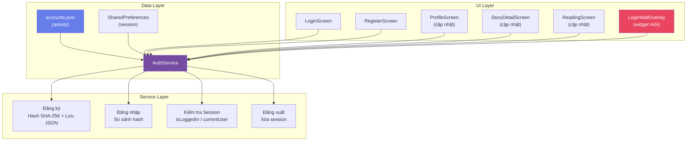
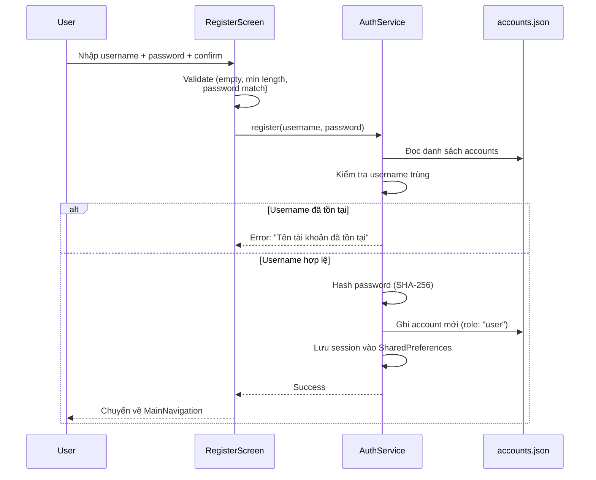
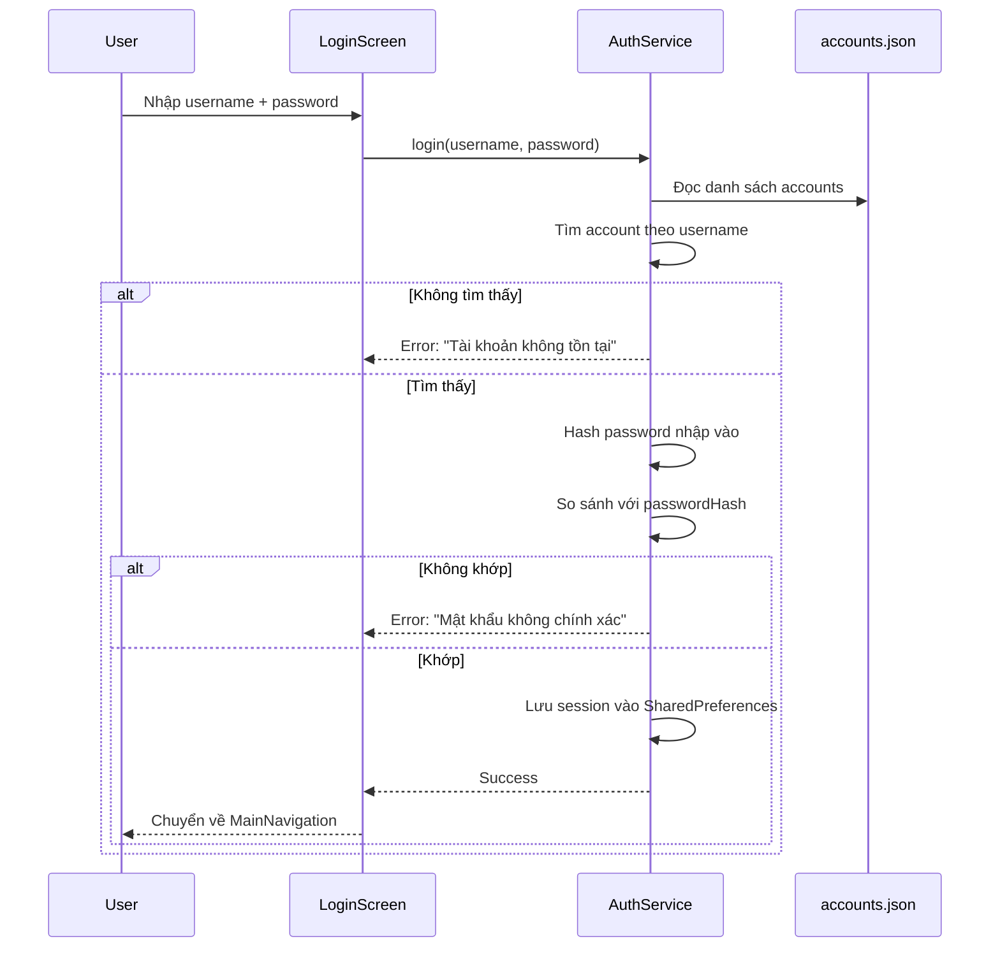
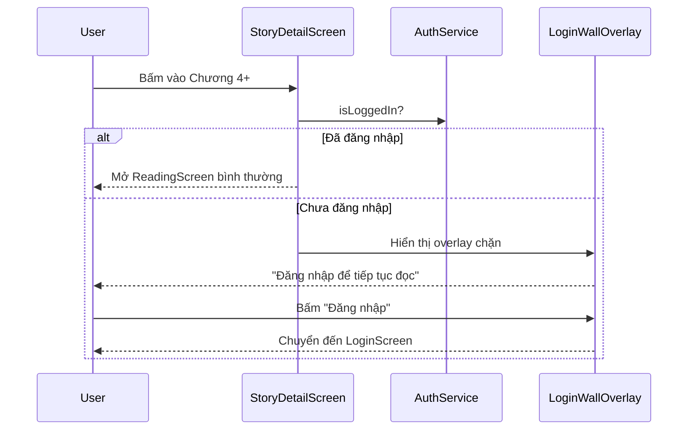

# Thêm Xác thực Người dùng & Phân quyền Truy cập cho MangaHay

## Mô tả Tổng quan

Thêm hệ thống xác thực (Đăng nhập/Đăng ký) và phân quyền truy cập nội dung cho ứng dụng MangaHay hiện tại. Trang chủ giữ nguyên public, nhưng từ chương 4 trở đi yêu cầu đăng nhập mới được đọc.

## User Review Required

> [!IMPORTANT]
> **Giới hạn chương miễn phí**: Kế hoạch hiện tại cho phép Guest đọc miễn phí **3 chương đầu** (`FREE_CHAPTER_LIMIT = 3`). Từ chương 4 trở đi sẽ hiển thị login-wall. Bạn có muốn đổi thành 4 chương không?

> [!IMPORTANT]
> **Mã hóa mật khẩu**: Sử dụng **SHA-256** (có sẵn trong `dart:convert` + `dart:crypto`) để hash mật khẩu trước khi lưu vào JSON. Đây là giải pháp cơ bản phù hợp cho ứng dụng demo. Bạn có đồng ý không?

> [!WARNING]
> **Dữ liệu mẫu hiện tại chỉ có 3 chương mỗi truyện**. Để demo tính năng login-wall, tôi sẽ thêm chương 4, 5, 6 (sử dụng lại các ảnh hiện có) vào `sample_truyen.dart` để người dùng có thể thấy được popup chặn.

---

## Kiến trúc Tổng thể



---

## Cấu trúc Dữ liệu

### Model `Account` ([NEW] `lib/models/account.dart`)

```dart
class Account {
  final String username;
  final String passwordHash;  // SHA-256 hash
  final String role;           // 'admin' hoặc 'user'
  final DateTime createdAt;

  // fromJson / toJson
}
```

### File `accounts.json` ([NEW] `assets/data/accounts.json`)

```json
[
  {
    "username": "admin",
    "passwordHash": "<sha256 hash of 'admin123'>",
    "role": "admin",
    "createdAt": "2026-04-12T00:00:00"
  }
]
```

### Session (SharedPreferences)

| Key | Kiểu | Mô tả |
|-----|-------|--------|
| `is_logged_in` | `bool` | Trạng thái đăng nhập |
| `current_username` | `String` | Username hiện tại |
| `current_role` | `String` | Vai trò (`admin`/`user`) |

---

## Luồng Hoạt động

### Luồng Đăng ký



### Luồng Đăng nhập



### Luồng Login-Wall (Chặn chương)



---

## Proposed Changes

### Data Layer

---

#### [NEW] [account.dart](file:///d:/Code/code/Android/webdoctruyen/lib/models/account.dart)

Model class cho tài khoản người dùng:
- Các trường: `username`, `passwordHash`, `role`, `createdAt`
- Methods: `fromJson()`, `toJson()`
- Kế thừa phong cách code hiện tại (immutable, required fields)

---

#### [NEW] [auth_service.dart](file:///d:/Code/code/Android/webdoctruyen/lib/services/auth_service.dart)

Service singleton quản lý toàn bộ logic xác thực:

| Method | Mô tả |
|--------|--------|
| `init()` | Load accounts từ JSON + đọc session từ SharedPreferences |
| `register(username, password)` | Tạo account mới, hash password, lưu JSON |
| `login(username, password)` | Xác thực, lưu session |
| `logout()` | Xóa session |
| `isLoggedIn` | Getter kiểm tra trạng thái |
| `currentUser` | Getter trả về Account hiện tại |
| `isAdmin` | Getter kiểm tra role admin |
| `hashPassword(password)` | SHA-256 hash |
| `canReadChapter(chapterIndex)` | Kiểm tra quyền đọc chương |

**Lưu trữ dữ liệu runtime**: Vì Flutter không thể ghi trực tiếp vào `assets/`, accounts sẽ được copy vào `Application Documents Directory` khi app khởi động lần đầu. Mọi thay đổi (đăng ký mới) sẽ ghi vào file này.

Cần thêm dependency:
- `path_provider` — lấy đường dẫn Application Documents Directory
- `crypto` — SHA-256 hashing

---

#### [NEW] [accounts.json](file:///d:/Code/code/Android/webdoctruyen/assets/data/accounts.json)

File JSON mặc định chứa tài khoản admin ban đầu.

---

#### [MODIFY] [sample_truyen.dart](file:///d:/Code/code/Android/webdoctruyen/lib/data/sample_truyen.dart)

Thêm **3 chương nữa** (chương 4, 5, 6) cho mỗi truyện để demo login-wall. Sử dụng lại ảnh manga hiện có, chỉ xáo trộn thứ tự.

---

### UI Layer — Màn hình Mới

---

#### [NEW] [login_screen.dart](file:///d:/Code/code/Android/webdoctruyen/lib/screens/login_screen.dart)

**Form đăng nhập** với thiết kế premium:
- Header gradient với icon app + slogan
- TextField `username` với icon `person`
- TextField `password` với icon `lock` + toggle show/hide
- Nút "Đăng nhập" với gradient
- Link "Chưa có tài khoản? **Đăng ký ngay**"
- Xử lý lỗi: hiển thị thông báo dưới field tương ứng
- Loading indicator khi đang xử lý
- Animation fade-in khi mở trang

---

#### [NEW] [register_screen.dart](file:///d:/Code/code/Android/webdoctruyen/lib/screens/register_screen.dart)

**Form đăng ký** với thiết kế tương đồng login:
- TextField `username` (min 3 ký tự)
- TextField `password` (min 6 ký tự)
- TextField `confirm password`
- Nút "Đăng ký"
- Link "Đã có tài khoản? **Đăng nhập**"
- Validation real-time (kiểm tra match password, độ dài)
- Thông báo lỗi "Tên tài khoản đã tồn tại" từ AuthService

---

#### [NEW] [login_wall_overlay.dart](file:///d:/Code/code/Android/webdoctruyen/lib/widgets/login_wall_overlay.dart)

**Widget overlay chặn nội dung** — hiển thị khi Guest bấm vào chương premium:

```
┌─────────────────────────────────┐
│  ░░░ Nội dung bị làm mờ ░░░    │  ← BackdropFilter blur
│                                 │
│    ┌───────────────────────┐    │
│    │   🔒 Nội dung VIP     │    │  ← Card glassmorphism
│    │                       │    │
│    │  Đăng nhập để tiếp    │    │
│    │  tục đọc truyện       │    │
│    │                       │    │
│    │  ┌─────────────────┐  │    │
│    │  │  🔑 Đăng nhập   │  │    │  ← Gradient button
│    │  └─────────────────┘  │    │
│    │  ┌─────────────────┐  │    │
│    │  │  📝 Đăng ký     │  │    │  ← Outlined button
│    │  └─────────────────┘  │    │
│    │                       │    │
│    └───────────────────────┘    │
│                                 │
└─────────────────────────────────┘
```

Thiết kế:
- `BackdropFilter` với `ImageFilter.blur` làm mờ nền
- Card trung tâm với glassmorphism effect (nền bán trong suốt + border mờ)
- Icon khóa lớn với animation scale
- Gradient button "Đăng nhập" + Outlined button "Đăng ký"
- Micro-animation: slide-up + fade-in khi xuất hiện

---

### UI Layer — Sửa đổi Màn hình Hiện tại

---

#### [MODIFY] [truyen_detail_screen.dart](file:///d:/Code/code/Android/webdoctruyen/lib/screens/truyen_detail_screen.dart)

Thay đổi logic trong **danh sách chương** (`SliverList`):
- Với `chapterIndex >= FREE_CHAPTER_LIMIT` (3):
  - Nếu Guest → hiển thị icon 🔒 trên `ChapterListTile` + khi bấm → show `LoginWallOverlay` dạng dialog
  - Nếu đã đăng nhập → mở `ReadingScreen` bình thường
- Nút "Đọc Ngay" giữ nguyên (luôn mở chương 1 — miễn phí)

---

#### [MODIFY] [chuong_list_tile.dart](file:///d:/Code/code/Android/webdoctruyen/lib/widgets/chuong_list_tile.dart)

Thêm prop `isLocked`:
- Khi `isLocked = true`: hiển thị icon 🔒 thay cho chevron, thêm badge "VIP" nhỏ
- Opacity giảm nhẹ cho text khi bị khóa

---

#### [MODIFY] [doc_truyen_screen.dart](file:///d:/Code/code/Android/webdoctruyen/lib/screens/doc_truyen_screen.dart)

Thêm kiểm tra quyền khi chuyển chương:
- Trong `_changeChapter()`: nếu chương mới >= `FREE_CHAPTER_LIMIT` và Guest → show login-wall (dialog) thay vì chuyển chương
- Trong `_showChapterList()`: đánh dấu chương locked tương tự `truyen_detail_screen`

---

#### [MODIFY] [profile_screen.dart](file:///d:/Code/code/Android/webdoctruyen/lib/screens/profile_screen.dart)

Cập nhật toàn bộ để phản ánh trạng thái auth:
- **Nếu đã đăng nhập**: Hiển thị username + role, nút "Đăng xuất"
- **Nếu chưa đăng nhập**: Hiển thị UI mời đăng nhập/đăng ký (thay cho thông tin cố định "Độc Giả")
- Thêm menu item "Đăng xuất" (nếu đã đăng nhập)
- Badge "Admin" cho tài khoản admin

---

#### [MODIFY] [main_navigation.dart](file:///d:/Code/code/Android/webdoctruyen/lib/screens/main_navigation.dart)

- Inject `AuthService` để theo dõi trạng thái đăng nhập
- Cập nhật label tab "Cá Nhân" → có indicator khi chưa đăng nhập

---

#### [MODIFY] [splash_screen.dart](file:///d:/Code/code/Android/webdoctruyen/lib/screens/splash_screen.dart)

- Gọi `AuthService.init()` trong quá trình splash để load accounts + session

---

### Config & Dependencies

---

#### [MODIFY] [pubspec.yaml](file:///d:/Code/code/Android/webdoctruyen/pubspec.yaml)

Thêm dependencies:
```yaml
dependencies:
  crypto: ^3.0.6          # SHA-256 hashing
  path_provider: ^2.1.5   # Lấy app documents directory
```

Thêm assets:
```yaml
assets:
  - assets/data/
```

---

#### [MODIFY] [constants.dart](file:///d:/Code/code/Android/webdoctruyen/lib/utils/constants.dart)

Thêm constants mới:
```dart
class AppAuth {
  static const int freeChapterLimit = 3;  // 3 chương miễn phí
  static const String accountsFile = 'accounts.json';
  static const String defaultAdminUsername = 'admin';
}

// Thêm strings trong AppStrings
static const String login = 'Đăng Nhập';
static const String register = 'Đăng Ký';
static const String logout = 'Đăng Xuất';
static const String loginRequired = 'Đăng nhập để tiếp tục đọc';
// ... 
```

---

## Tóm tắt Files

| Loại | File | Mô tả |
|------|------|--------|
| 🆕 NEW | `lib/models/account.dart` | Model Account |
| 🆕 NEW | `lib/services/auth_service.dart` | Service xác thực |
| 🆕 NEW | `lib/screens/login_screen.dart` | Màn hình đăng nhập |
| 🆕 NEW | `lib/screens/register_screen.dart` | Màn hình đăng ký |
| 🆕 NEW | `lib/widgets/login_wall_overlay.dart` | Widget chặn nội dung |
| 🆕 NEW | `assets/data/accounts.json` | File tài khoản mặc định |
| ✏️ MODIFY | `lib/data/sample_truyen.dart` | Thêm chương 4-6 |
| ✏️ MODIFY | `lib/screens/truyen_detail_screen.dart` | Logic chặn chương |
| ✏️ MODIFY | `lib/screens/doc_truyen_screen.dart` | Kiểm tra quyền chuyển chương |
| ✏️ MODIFY | `lib/screens/profile_screen.dart` | Hiển thị auth state |
| ✏️ MODIFY | `lib/screens/main_navigation.dart` | Inject AuthService |
| ✏️ MODIFY | `lib/screens/splash_screen.dart` | Init AuthService |
| ✏️ MODIFY | `lib/widgets/chuong_list_tile.dart` | Thêm prop isLocked |
| ✏️ MODIFY | `lib/utils/constants.dart` | Thêm auth constants |
| ✏️ MODIFY | `pubspec.yaml` | Thêm dependencies |

---

## Verification Plan

### Build & Run
```bash
flutter pub get
flutter analyze
flutter run
```

### Test thủ công

1. **Trang chủ public** — Mở app, xem danh sách truyện mà không cần đăng nhập ✓
2. **Đọc 3 chương miễn phí** — Bấm truyện bất kỳ → đọc chương 1, 2, 3 bình thường ✓  
3. **Login-wall ở chương 4** — Bấm chương 4 → hiển thị overlay chặn đẹp mắt ✓
4. **Đăng ký** — Tạo tài khoản mới → kiểm tra validation → thành công ✓
5. **Đăng nhập** — Đăng nhập tài khoản vừa tạo → chuyển về trang chủ ✓
6. **Đọc chương 4+ sau đăng nhập** — Bấm chương 4 → mở ReadingScreen thành công ✓
7. **Lỗi sai mật khẩu** — Nhập sai mật khẩu → hiển thị thông báo lỗi ✓
8. **Lỗi trùng username** — Đăng ký username đã có → hiển thị thông báo lỗi ✓
9. **Đăng xuất** — Bấm đăng xuất ở profile → trở về trạng thái Guest ✓
10. **Phiên đăng nhập** — Đóng app, mở lại → vẫn giữ trạng thái đăng nhập ✓
